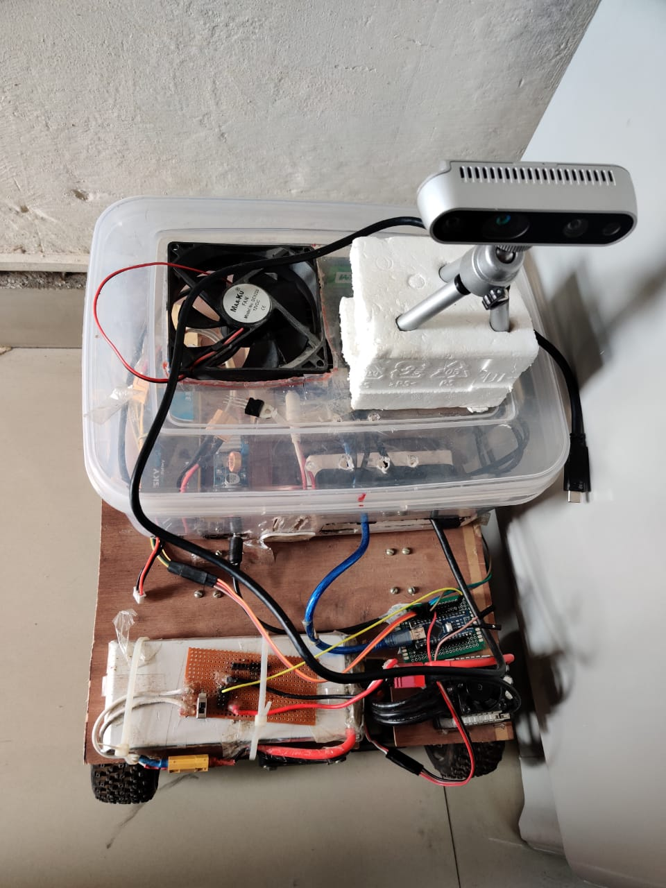
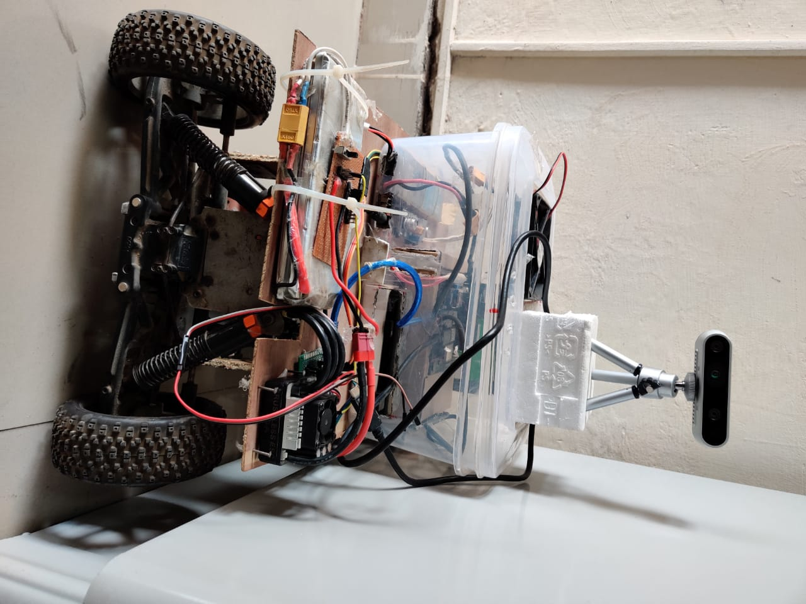

# self-driving-electric-car
In this project we convert a RC car in self driving electric car with help of motors, Realsense depth camera, arduino, jetson nano and a CNN model(which predicts speed and steering angle).

Here some images of car

